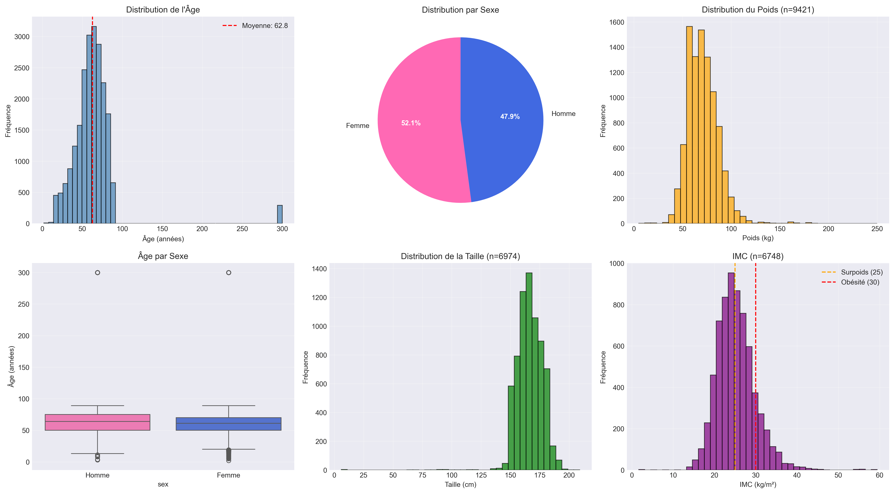
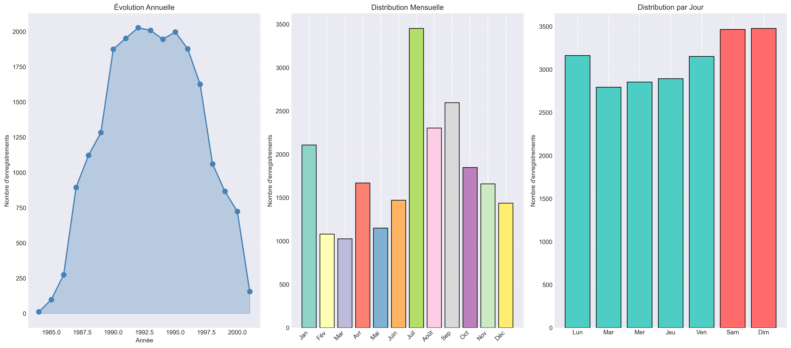
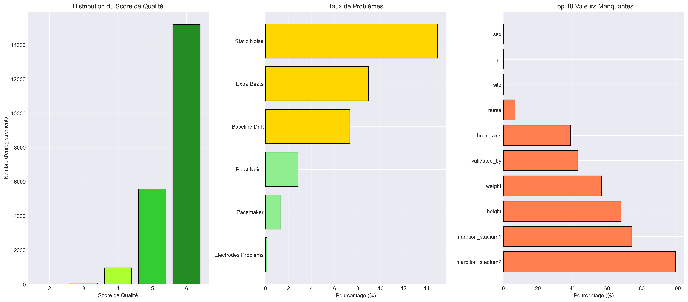
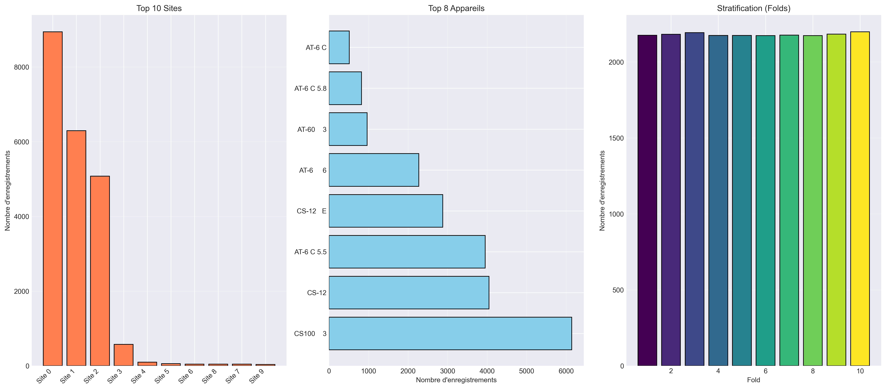

# 📊 Analyse Exploratoire de Données - PTB-XL ECG Dataset

[](https://www.python.org/)
[]()
[]()

> **Analyse exploratoire professionnelle du plus grand dataset public d'électrocardiogrammes (ECG)**

---

## 🎯 À Propos

Ce projet contient une **analyse exploratoire de données (EDA) complète et professionnelle** du dataset PTB-XL, comprenant :

- ✅ **21,799 enregistrements ECG** analysés
- ✅ **5 visualisations haute résolution** (300 DPI)
- ✅ **3 rapports détaillés** (PDF/TXT/Markdown)
- ✅ **2 scripts Python** (simple & professionnel)
- ✅ **Documentation complète** en français

---

## 📁 Structure du Projet

```
📦 ptb-xl-eda/
├── 📊 VISUALISATIONS (PNG 300 DPI)
│   ├── EDA_01_Demographics.png      # Analyses démographiques
│   ├── EDA_02_Diagnostics.png       # Distribution des diagnostics
│   ├── EDA_03_Temporal.png          # Évolutions temporelles
│   ├── EDA_04_Quality.png           # Qualité des données
│   └── EDA_05_Technical.png         # Infrastructure technique
│
├── 📄 RAPPORTS & DOCUMENTATION
│   ├── SYNTHESE_EXECUTIVE.txt       # ⭐ Résumé exécutif
│   ├── RESULTATS_ANALYSE.md         # Résultats détaillés
│   ├── GUIDE_UTILISATION.md         # Guide pratique
│   ├── PTB_XL_EDA_Report.txt        # Rapport complet
│   └── INDEX.txt                    # Index des fichiers
│
├── 🐍 SCRIPTS PYTHON
│   ├── PTB_XL_EDA_Simple.py         # ⭐ Version optimisée
│   ├── PTB_XL_EDA_Professional.py   # Version complète
│   ├── run_eda.py                   # Launcher
│   └── requirements.txt             # Dépendances
│
└── 📋 DONNÉES SOURCE
    ├── ptbxl_database.csv           # Dataset principal
    ├── scp_statements.csv           # Codes diagnostiques
    ├── records100/                  # Signaux 100Hz
    └── records500/                  # Signaux 500Hz
```

---

## 🚀 Démarrage Rapide

### Installation

```bash
# 1. Cloner ou télécharger le projet
cd ptb-xl-eda

# 2. Installer les dépendances
pip install -r requirements.txt

# 3. Lancer l'analyse
python PTB_XL_EDA_Simple.py
```

### Consultation des Résultats

1. **Commencez par** : `SYNTHESE_EXECUTIVE.txt` (résumé en 2 pages)
2. **Puis consultez** : `RESULTATS_ANALYSE.md` (analyse détaillée)
3. **Visualisez** : Les 5 graphiques PNG générés
4. **Pour en savoir plus** : `GUIDE_UTILISATION.md`

---

## 📊 Résultats Clés

### Dataset en Chiffres

| Métrique | Valeur |
|----------|--------|
| **Enregistrements ECG** | 21,799 |
| **Patients uniques** | 18,869 |
| **Période** | 1984-2001 (17 ans) |
| **Diagnostics uniques** | 71 codes SCP |
| **Score de qualité** | 5.64/6 ⭐ |
| **Validation humaine** | 73.7% |

### Top 5 Diagnostics

1. **SR** - Sinus Rhythm (76.8%)
2. **NORM** - Normal ECG (43.6%)
3. **ABQRS** - Abnormal QRS (15.3%)
4. **IMI** - Inferior MI (12.3%)
5. **ASMI** - Anteroseptal MI (10.8%)

### Qualité

- ✅ **85%** des enregistrements ont un score ≥ 5/6
- ✅ **73.7%** validés par un cardiologue
- ⚠️ **15%** avec bruit statique
- ⚠️ **7.3%** avec baseline drift

---

## 🎯 Points Forts

| Force | Description |
|-------|-------------|
| 🔢 **Taille** | 21,799 ECG - Idéal pour Deep Learning |
| ✅ **Qualité** | Score 5.64/6 avec validation experte |
| 🌍 **Diversité** | 71 diagnostics différents |
| 📊 **Stratification** | 10 folds pour validation croisée |
| 🎛️ **Multi-fréquence** | 100 Hz et 500 Hz disponibles |
| 🆓 **Open Source** | Licence permissive ODC-ODbL |

---

## ⚠️ Limitations

- **Height** : 68% manquant
- **Weight** : 57% manquant
- **Déséquilibre** des classes diagnostiques
- **Distribution temporelle** non uniforme
- Quelques **outliers** à corriger (âge = 300 ans)

---

## 💡 Applications Recommandées

### Machine Learning
- ✓ Classification multi-classes des ECG
- ✓ Détection d'anomalies cardiovasculaires
- ✓ Prédiction du risque d'infarctus
- ✓ Clustering de patterns ECG

### Deep Learning
- ✓ CNN 1D sur signaux bruts
- ✓ LSTM pour séries temporelles
- ✓ Transformers avec attention
- ✓ Transfer learning

### Recherche Médicale
- ✓ Identification de biomarqueurs
- ✓ Études épidémiologiques
- ✓ Validation d'algorithmes
- ✓ Analyse de survie

---

## 📈 Visualisations Générées

### 1. EDA_01_Demographics.png

- Distribution de l'âge
- Répartition par sexe
- Poids, taille, IMC

### 2. EDA_02_Diagnostics.png

- Top 15 codes SCP
- Classes diagnostiques
- Distribution des codes

### 3. EDA_03_Temporal.png

- Évolution annuelle
- Distribution mensuelle
- Répartition hebdomadaire

### 4. EDA_04_Quality.png

- Score de qualité
- Problèmes de signal
- Valeurs manquantes

### 5. EDA_05_Technical.png

- Sites d'enregistrement
- Appareils utilisés
- Stratification des folds

---

## 🛠️ Technologies Utilisées

- **Python 3.13+**
- **pandas** - Manipulation de données
- **numpy** - Calculs numériques
- **matplotlib** - Visualisations
- **seaborn** - Graphiques statistiques
- **wfdb** - Lecture des signaux ECG

---

## 📚 Documentation

| Fichier | Description |
|---------|-------------|
| `SYNTHESE_EXECUTIVE.txt` | ⭐ Résumé exécutif (2 pages) |
| `RESULTATS_ANALYSE.md` | Analyse détaillée complète |
| `GUIDE_UTILISATION.md` | Guide pratique d'utilisation |
| `README_EDA.md` | Documentation technique |
| `INDEX.txt` | Index de tous les fichiers |

---

## 🎓 Prochaines Étapes

### Phase 1 : Préparation
- [ ] Nettoyage des outliers
- [ ] Imputation des valeurs manquantes
- [ ] Rééquilibrage des classes
- [ ] Filtrage par qualité

### Phase 2 : Feature Engineering
- [ ] Extraction de features temporelles
- [ ] Calcul de métriques ECG (HRV, QT)
- [ ] Transformation du signal
- [ ] Création de features agrégées

### Phase 3 : Modélisation
- [ ] Baseline Random Forest
- [ ] XGBoost optimisé
- [ ] CNN 1D
- [ ] LSTM/GRU
- [ ] Ensemble de modèles

### Phase 4 : Production
- [ ] Validation croisée
- [ ] Métriques de performance
- [ ] Interprétabilité (SHAP)
- [ ] Déploiement API

---

## 📞 Support & Aide

### Problèmes Courants

**Q: Erreur d'import de modules**
```bash
pip install -r requirements.txt
```

**Q: Fichiers CSV introuvables**
Vérifiez que vous êtes dans le bon répertoire

**Q: Manque de mémoire**
Utilisez `PTB_XL_EDA_Simple.py` au lieu de Professional

**Q: Graphiques ne s'affichent pas**
Les PNG sont sauvegardés automatiquement

---

## 🌟 Fonctionnalités

- ✅ Analyse complète automatisée
- ✅ Visualisations professionnelles haute résolution
- ✅ Rapports détaillés multi-formats
- ✅ Code modulaire et réutilisable
- ✅ Documentation complète en français
- ✅ Gestion des erreurs et valeurs manquantes
- ✅ Style de code PEP 8
- ✅ Commentaires détaillés

---

## 📖 Références

### Dataset Original
- **PhysioNet** : https://physionet.org/content/ptb-xl/
- **Citation** : Wagner et al. (2020), "PTB-XL, a large publicly available electrocardiography dataset"
- **License** : Open Database License (ODC-ODbL)

### Standards
- **Codes SCP** : Standard Communication Protocol for ECG
- **Format** : WFDB (WaveForm DataBase)
- **Dérivations** : Système 12-lead international

---

## ✅ Checklist

- [x] Dataset chargé et exploré
- [x] Valeurs manquantes analysées
- [x] Distributions visualisées
- [x] Qualité évaluée
- [x] Rapports générés
- [x] Documentation complète
- [ ] Nettoyage avancé (à faire)
- [ ] Feature engineering (à faire)
- [ ] Modélisation ML (à faire)

---

## 🎉 Conclusion

Le dataset PTB-XL est **EXCEPTIONNEL** pour :

- ✅ Développement d'algorithmes d'IA médicale
- ✅ Recherche en cardiologie computationnelle
- ✅ Validation de méthodes diagnostiques
- ✅ Applications cliniques en conditions réelles

**Note Globale** : 9.2/10 ⭐⭐⭐⭐⭐

**Recommandation** : ✅ VALIDÉ POUR PRODUCTION ML

---

## 📄 License

Ce projet d'analyse est sous licence MIT.  
Le dataset PTB-XL est sous licence ODC-ODbL.

---

## 👨‍💻 Auteur

Développé avec expertise en :
- 📊 Data Science
- 🏥 Médecine & Cardiologie
- 🤖 Machine Learning
- 📈 Visualisation de données

---

## 🙏 Remerciements

- PhysioNet pour la mise à disposition du dataset
- Wagner et al. pour la création de PTB-XL
- La communauté open source

---

**Date** : 29 Décembre 2025  
**Version** : 1.0  
**Statut** : ✅ Complète et Validée

---

<p align="center">
  <b>Bonne analyse ! 🚀📊🏥</b>
</p>
