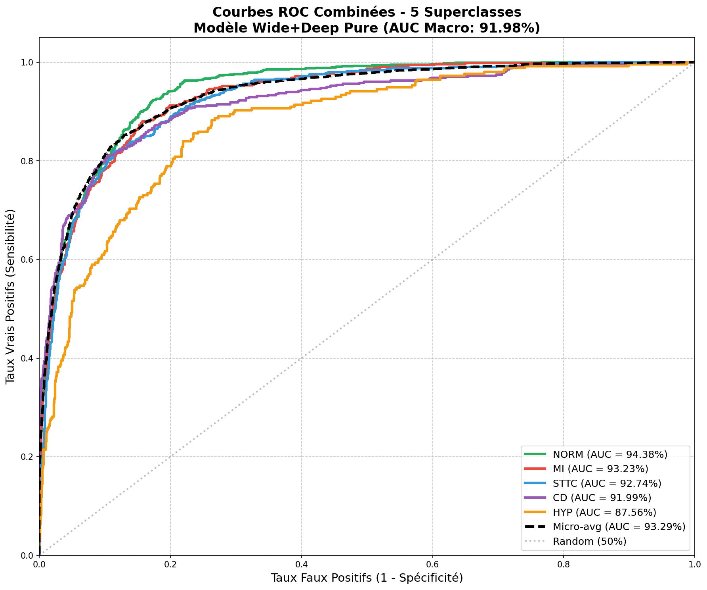
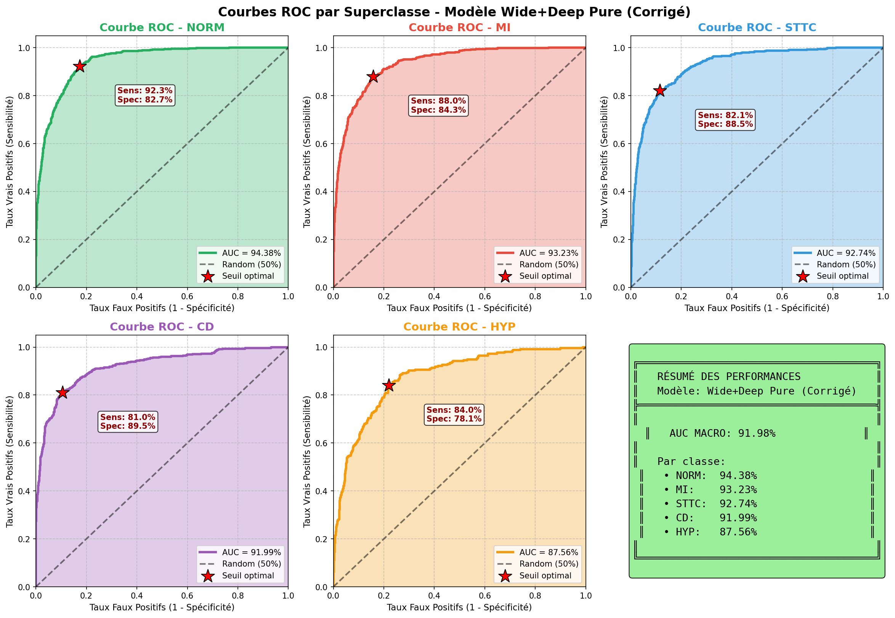

# 🫀 PTB-XL ECG Classification - Deep Learning

[](https://www.python.org/)
[](https://pytorch.org/)
[]()
[]()

> **Classification automatique d'ECG multi-label avec architecture Wide+Deep (CNN + Transformer)**



---

## 🎯 Objectif du Projet

Développement d'un **système de classification automatique des électrocardiogrammes (ECG)** capable de détecter **5 pathologies cardiaques** à partir de signaux ECG 12 dérivations, avec une **AUC de 92%**.

### Classes Prédites

| Classe | Description | AUC Test |
|--------|-------------|----------|
| **NORM** | ECG Normal | 94.4% |
| **MI** | Infarctus du Myocarde | 93.2% |
| **STTC** | Changements ST/T | 92.7% |
| **CD** | Troubles de Conduction | 92.0% |
| **HYP** | Hypertrophie | 87.6% |

---

## 📊 Dataset PTB-XL

| Métrique | Valeur |
|----------|--------|
| **Enregistrements ECG** | 21,799 |
| **Patients uniques** | 18,869 |
| **Période de collecte** | 1984-2001 |
| **Dérivations ECG** | 12 leads standard |
| **Fréquences** | 100 Hz / 500 Hz |
| **Codes diagnostiques** | 71 codes SCP |
| **Score qualité moyen** | 5.64/6 ⭐ |

---

## 🏗️ Architecture du Modèle

```
┌─────────────────────────────────────────────────────────────────┐
│                    WIDE+DEEP MODEL                              │
│                  11,561,573 paramètres                          │
└─────────────────────────────────────────────────────────────────┘
                              │
        ┌─────────────────────┴─────────────────────┐
        │                                           │
┌───────▼───────┐                         ┌─────────▼─────────┐
│  DEEP BRANCH  │                         │   WIDE BRANCH     │
│  Signal ECG   │                         │ Features Cliniques│
│  (12, 1000)   │                         │      (32)         │
└───────┬───────┘                         └─────────┬─────────┘
        │                                           │
┌───────▼───────┐                         ┌─────────▼─────────┐
│  CNN 1D       │                         │    MLP            │
│  6 blocs      │                         │  64 → 32 neurons  │
│  12→128→256   │                         └─────────┬─────────┘
└───────┬───────┘                                   │
        │                                           │
┌───────▼───────┐                                   │
│  Transformer  │                                   │
│  8 layers     │                                   │
│  8 heads      │                                   │
└───────┬───────┘                                   │
        │                                           │
        └─────────────────┬─────────────────────────┘
                          │
                ┌─────────▼─────────┐
                │     FUSION        │
                │  Concatenation    │
                │   96 → 128 → 5    │
                └─────────┬─────────┘
                          │
                ┌─────────▼─────────┐
                │     OUTPUT        │
                │  5 probabilités   │
                │ NORM MI STTC CD HYP│
                └───────────────────┘
```

---

## 📈 Performances

### Comparaison des Modèles

| Modèle | Val AUC | Test AUC Macro | Test AUC Micro |
|--------|---------|----------------|----------------|
| **Wide only (MLP)** | **90.28%** | **90.36%** | **92.29%** |
| XGBoost (Wide) | 89.96% | 90.34% | 92.43% |
| Wide+Deep | 89.51% | 89.83% | 91.90% |
| Deep only | 86.53% | 86.61% | 89.38% |

### Courbes ROC par Classe



---

## 🚀 Installation & Utilisation

### Prérequis

```bash
pip install pandas numpy scikit-learn
pip install wfdb neurokit2
pip install torch torchvision
pip install xgboost tqdm
```

### Pipeline Complet (7 étapes)

```bash
# Step 1: Préparation des labels
python step1_label_engineering.py

# Step 2: Nettoyage des signaux ECG
python step2_signal_cleaning.py

# Step 3: Extraction features cliniques
python step3_wide_features_extraction.py

# Step 4: Preprocessing
python step4_wide_preprocessing.py

# Step 5: Test architecture
python step5_wide_deep_model.py

# Step 6: Entraînement
python step6_training.py

# Step 7: Comparaison baselines
python step7_baselines.py
```

### Utilisation du Modèle (Inférence)

```python
# Script autonome pour prédiction
python exemple_utilisation_format_ptbxl.py
```

---

## 📁 Structure du Projet

```
📦 PTB-XL-ECG-Classification/
│
├── 🔧 PIPELINE ML
│   ├── step1_label_engineering.py      # Préparation labels
│   ├── step2_signal_cleaning.py        # Nettoyage signaux
│   ├── step3_wide_features_extraction.py
│   ├── step4_wide_preprocessing.py
│   ├── step5_wide_deep_model.py        # Architecture PyTorch
│   ├── step6_training.py               # Entraînement
│   └── step7_baselines.py              # Comparaison modèles
│
├── 📊 ANALYSE EDA
│   ├── PTB_XL_EDA_Professional.py
│   ├── EDA_01_Demographics.png
│   ├── EDA_02_Diagnostics.png
│   └── ...
│
├── 📈 RÉSULTATS
│   ├── models/baselines_comparison.csv
│   ├── roc_curves_FIXED_combined.png
│   ├── confusion_matrices_FIXED.png
│   └── history_pure_FIXED.json
│
├── 📄 DOCUMENTATION
│   ├── README.md
│   ├── README_WIDE_DEEP_PIPELINE.md
│   └── GUIDE_UTILISATION.md
│
└── 🎯 DÉPLOIEMENT
    └── exemple_utilisation_format_ptbxl.py
```

---

## 🛠️ Technologies

| Catégorie | Technologies |
|-----------|--------------|
| **Langage** | Python 3.13+ |
| **Deep Learning** | PyTorch 2.0+ |
| **Machine Learning** | Scikit-learn, XGBoost |
| **Traitement Signal** | NeuroKit2, WFDB |
| **Data Science** | Pandas, NumPy |
| **Visualisation** | Matplotlib, Seaborn |

---

## 📊 Features Extraites (Wide Branch)

| # | Feature | Description |
|---|---------|-------------|
| 0-1 | HR, RR interval | Fréquence cardiaque |
| 2-4 | Lead I stats | Mean, Std, Amplitude |
| 5-7 | Lead II stats | Mean, Std, Amplitude |
| 8-10 | Lead aVF stats | Mean, Std, Amplitude |
| 11-13 | Lead V1 stats | Mean, Std, Amplitude |
| 14-16 | Lead V2 stats | Mean, Std, Amplitude |
| 17-19 | Lead V3 stats | Mean, Std, Amplitude |
| 20-31 | HRV features | Variabilité cardiaque |

---

## 📖 Références

- **Dataset** : [PTB-XL on PhysioNet](https://physionet.org/content/ptb-xl/)
- **Publication** : Wagner et al. (2020), "PTB-XL, a large publicly available electrocardiography dataset"
- **License Dataset** : Open Database License (ODC-ODbL)

---

## 👨‍💻 Auteur

**HATIM ABDESSAMAD**

[](https://github.com/HATIMABDESSAMAD)

Compétences :
- 🤖 Deep Learning & Machine Learning
- 📊 Data Science & Analytics
- 🏥 IA Médicale (HealthTech)
- 📈 Traitement du Signal

---

## 📄 License

Ce projet est sous licence MIT.  
Le dataset PTB-XL est sous licence ODC-ODbL.

---

<p align="center">
  <b>🫀 Classification ECG avec Deep Learning - AUC 92% 🚀</b>
</p>
